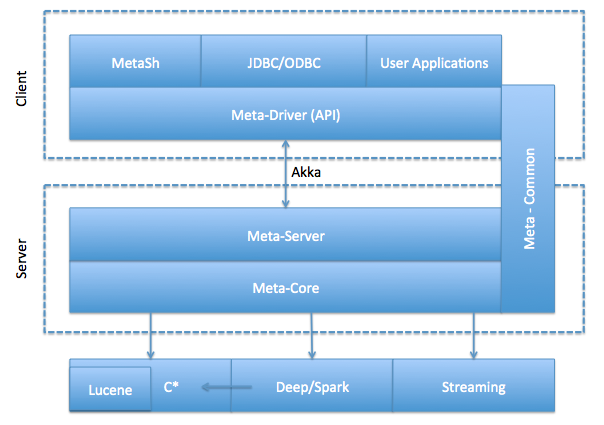
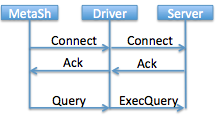
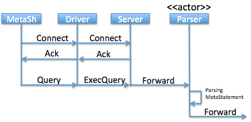
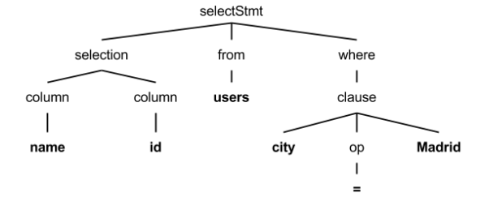
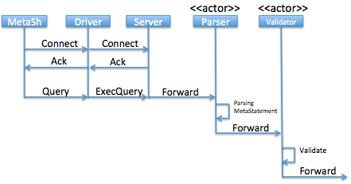
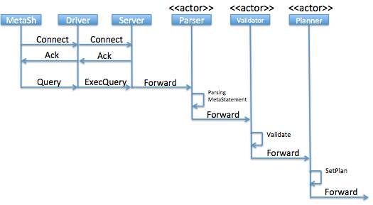
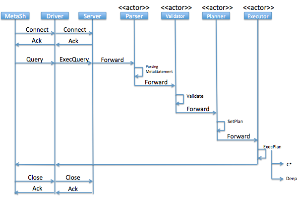

Stratio Meta is one of the core modules on which the Stratio platform is based. It is a abstraction to distributed 
programming that combines streaming and batch process.

Table of Contents
=================

-   [Introduction](#introduction)
-   [Features](#features)
-   [Architecture](#architecture)

**Introduction**
================

Meta is a simple and elegant framework designed to unify batch and stream processing using a common language. 
The Meta language maintains the friendliness of SQL and CQL while providing streaming processing capabilities.

**Features**
============

-   Unified language with streaming and batch support.
-   Reliable fault-tolerant architecture.
-   Authentication, authorization and auditing support.
-   Support for Cassandra-Lucene indexes.
-   UDF support.
-   Trigger support.
-   Extended CQL.
-   Java API to develop custom applications.

**Architecture**
================

The META architecture is composed of two main elements: client and server.

The client is in charge of receiving user requests either from the MetaSh or from the API. Once a request is 
received, the client performs an initial validation and sends the command to the server in order to execute the query itself.

The META server receives user requests and processes them in several steps: Parsing, Validation, Planning and Execution.

To show how META server works, examples based on the following query will be used for each step:

~~~~ {.prettyprint .lang-meta}
SELECT name, id FROM users WHERE city = "Madrid";
~~~~

Step 1: Parsing
---------------

The parser will validate the syntax and build the following tree:

Step 2: Validation
------------------

During this step, the server checks that the query is semantically valid. For example:

1.  Checks that the users table exists in the database.
2.  Checks that the columns, name id and city, are present in the users table.
3.  Checks that the operator “=” can be applied to the city column and the string “Madrid”.

Step 3: Planning
----------------

The server builds the execution plan.

Step 4: Execution
-----------------

The server executes the query by launching the required Cassandra and Spark operations. The results of the 
execution are then forwarded back to the client.

Where to go from here
=====================

To explore and play with Stratio Meta, we recommend taking the 
[First steps with Stratio Meta](first-steps-with-stratio-meta.html "First steps with Stratio Meta") 
tutorial, and visiting the [Meta Reference](meta-reference.html "Meta Reference") manual.
